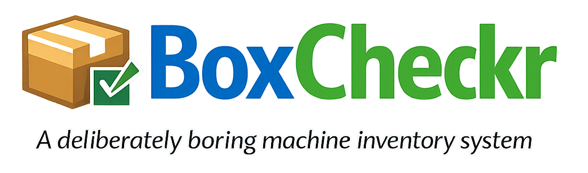

<p align="center">
  
</p>

<p align="center">
  <strong>A lightweight, transparent machine inventory system for SOC compliance.</strong>
</p>

<p align="center">
  Users self-enroll their machines via simple scripts, and admins can view security posture across the organization.
</p>

---

> **Note:** This project was vibe coded with Claude. It's a functional starting point but should be reviewed before production use.

## Features

- **Self-service enrollment** - Users enroll their own machines with a simple copy-paste script
- **Transparent collection** - Scripts are single-file, inspectable, and collect only what's documented
- **Minimal data** - Only collects: hostname, OS version, disk encryption status, antivirus status
- **Append-only history** - All inventory snapshots are preserved for compliance auditing
- **Microsoft Entra ID auth** - SSO with your organization's Azure AD
- **Role-based access** - Admins see all machines, users see only their own
- **Two enrollment modes** - One-time scan or scheduled weekly monitoring

## What Gets Collected

| Data | macOS | Windows | Linux |
|------|-------|---------|-------|
| Hostname | `hostname` | `$env:COMPUTERNAME` | `hostname` |
| OS Version | `sw_vers` | WMI | `/etc/os-release` |
| Disk Encryption | FileVault status | BitLocker status | LUKS detection |
| Antivirus | XProtect | Windows Defender | ClamAV |

**Not collected:** passwords, files, browsing history, keystrokes, screenshots, or personal data.

## Quick Start

### Prerequisites

- [mise](https://mise.jdx.dev/) for tool management
- Docker (for deployment)
- Microsoft Entra ID (Azure AD) tenant

### Development

```bash
# Install dependencies
mise install

# Set environment variables (see .mise.toml for full list)
export AZURE_TENANT_ID=your-tenant-id
export AZURE_CLIENT_ID=your-client-id
export AZURE_CLIENT_SECRET=your-secret

# Run development server
mise run dev

# Run tests
mise run test
```

### Docker Deployment

```bash
# Build and run with docker-compose
docker-compose up --build

# Or pull from GHCR
docker pull ghcr.io/yourorg/boxcheckr:latest
docker run -p 8080:8080 \
  -e AZURE_TENANT_ID=... \
  -e AZURE_CLIENT_ID=... \
  -e AZURE_CLIENT_SECRET=... \
  -e BASE_URL=https://inventory.yourcompany.com \
  -v boxcheckr-data:/data \
  ghcr.io/yourorg/boxcheckr:latest
```

## Configuration

All configuration is via environment variables:

| Variable | Required | Default | Description |
|----------|----------|---------|-------------|
| `AZURE_TENANT_ID` | Yes | - | Azure AD tenant ID |
| `AZURE_CLIENT_ID` | Yes | - | Azure App Registration client ID |
| `AZURE_CLIENT_SECRET` | Yes | - | Azure App Registration client secret |
| `AZURE_ADMIN_ROLE` | No | `InventoryAdmin` | App role name for admin access |
| `PORT` | No | `8080` | Server port |
| `BASE_URL` | No | `http://localhost:8080` | Public URL for callbacks and scripts |
| `DATABASE_PATH` | No | `./boxcheckr.db` | SQLite database path |
| `SESSION_SECRET` | No | (random) | Session encryption key |

### Azure AD Setup

1. Go to **Azure Portal** > **Azure Active Directory** > **App registrations**
2. Create a new registration:
   - Name: `BoxCheckr`
   - Redirect URI: `{BASE_URL}/auth/callback` (e.g., `https://inventory.yourcompany.com/auth/callback`)
3. Under **Certificates & secrets**, create a client secret
4. Under **API permissions**, add `Microsoft Graph > User.Read` (delegated)
5. Under **App roles**, create a role:
   - Display name: `Inventory Admin`
   - Value: `InventoryAdmin`
   - Allowed member types: Users/Groups
6. Under **Enterprise Applications** > your app > **Users and groups**, assign the admin role to admin users

## Architecture

```
┌─────────────────┐     ┌──────────────────┐     ┌─────────────┐
│  Cloudflare/    │────▶│   BoxCheckr      │────▶│  SQLite DB  │
│  Traefik        │     │   (Go HTTP)      │     │             │
└─────────────────┘     └──────────────────┘     └─────────────┘
                               │
                               ▼
                        ┌──────────────┐
                        │ Entra ID     │
                        │ (Azure AD)   │
                        └──────────────┘
```

- **Backend**: Go 1.22+ with minimal dependencies
- **Database**: SQLite with WAL mode
- **Auth**: Microsoft Entra ID (OIDC)
- **Frontend**: Server-rendered HTML + htmx + TailwindCSS (CDN)

## API

### Agent Endpoint

```bash
POST /api/v1/inventory
Authorization: Bearer <enrollment-token>
Content-Type: application/json

{
  "hostname": "my-macbook.local",
  "os": "darwin",
  "os_version": "14.0",
  "disk_encrypted": true,
  "disk_encryption_details": "FileVault enabled",
  "antivirus_enabled": true,
  "antivirus_details": "XProtect active"
}
```

## License

MIT - see [LICENSE](LICENSE)
